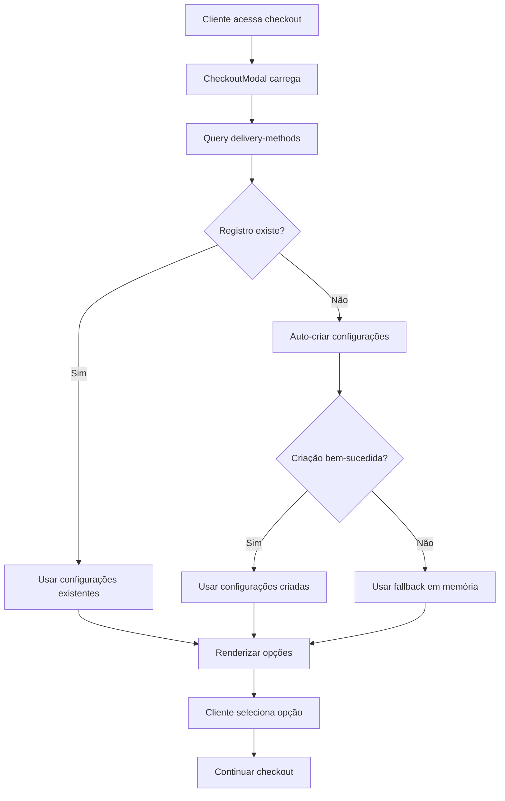

# Design Document

## Overview

Este documento descreve a solução para resolver as inconsistências no sistema de métodos de entrega entre diferentes lojas. A solução foca em criar um sistema robusto de auto-configuração, fallbacks e recuperação de erros para garantir que o checkout funcione consistentemente em todas as lojas.

## Architecture

### Current State Analysis

**Funcionando (Domínio Pizzas):**
- Possui registro na tabela `delivery_methods` com configurações corretas
- `delivery: true, pickup: true`
- Checkout carrega opções corretamente

**Não Funcionando (Outras lojas):**
- Falta de registros na tabela `delivery_methods`
- Sistema tenta criar automaticamente mas pode falhar
- Checkout fica em loading infinito ou mostra erro

### Proposed Solution Architecture



## Components and Interfaces

### 1. Enhanced Delivery Methods Query

**Localização:** `src/components/cardapio/public/CheckoutModal.tsx`

**Melhorias:**
- Implementar retry com backoff exponencial
- Adicionar fallbacks robustos
- Melhorar logging de erros
- Implementar auto-correção de configurações inconsistentes

### 2. Auto-Configuration Service

**Nova funcionalidade:** Sistema inteligente de criação de configurações padrão

**Regras de negócio:**
- **300 Graus:** `delivery: true, pickup: false`
- **Quadrata Pizzas:** `delivery: true, pickup: false`
- **Domínio Pizzas:** `delivery: true, pickup: true`
- **Padrão geral:** `delivery: true, pickup: true`

### 3. Fallback Configuration System

**Implementação:** Configurações em memória quando banco falha

```typescript
const FALLBACK_CONFIGS = {
  '300graus': { delivery: true, pickup: false, eat_in: false },
  'quadratapizzas': { delivery: true, pickup: false, eat_in: false },
  'dominiopizzas': { delivery: true, pickup: true, eat_in: false },
  'default': { delivery: true, pickup: true, eat_in: false }
};
```

### 4. Error Recovery System

**Componentes:**
- Retry mechanism com exponential backoff
- Graceful degradation
- User-friendly error messages
- Fallback to contact information

## Data Models

### DeliveryMethods Table Structure

```sql
CREATE TABLE delivery_methods (
  id UUID PRIMARY KEY DEFAULT gen_random_uuid(),
  company_id UUID NOT NULL REFERENCES companies(id),
  delivery BOOLEAN DEFAULT true,
  pickup BOOLEAN DEFAULT true,
  eat_in BOOLEAN DEFAULT false,
  created_at TIMESTAMP DEFAULT NOW(),
  updated_at TIMESTAMP DEFAULT NOW(),
  UNIQUE(company_id)
);
```

### Enhanced Query Interface

```typescript
interface DeliveryMethodsQuery {
  data: DeliveryMethods | null;
  isLoading: boolean;
  error: Error | null;
  isRetrying: boolean;
  retryCount: number;
  fallbackUsed: boolean;
}

interface DeliveryMethods {
  delivery: boolean;
  pickup: boolean;
  eat_in: boolean;
  source: 'database' | 'auto-created' | 'fallback';
}
```

## Error Handling

### Error Categories

1. **Network Errors:** Timeout, connection issues
2. **Database Errors:** Query failures, constraint violations
3. **Configuration Errors:** Missing or invalid data
4. **Permission Errors:** RLS policy violations

### Recovery Strategies

1. **Immediate Retry:** Para erros temporários de rede
2. **Exponential Backoff:** Para erros persistentes
3. **Auto-Creation:** Para registros faltantes
4. **Fallback Configs:** Para falhas críticas
5. **User Notification:** Para erros irrecuperáveis

### Error Messages

```typescript
const ERROR_MESSAGES = {
  LOADING: "Carregando opções de entrega...",
  NETWORK_ERROR: "Problema de conexão. Tentando novamente...",
  CONFIG_ERROR: "Configurando opções de entrega...",
  FALLBACK_USED: "Usando configurações padrão temporariamente",
  CRITICAL_ERROR: "Não foi possível carregar opções de entrega. Entre em contato conosco."
};
```

## Testing Strategy

### Unit Tests

1. **Query Logic:** Testar cenários de sucesso, falha e retry
2. **Auto-Creation:** Verificar criação correta de configurações
3. **Fallback System:** Validar uso de configurações padrão
4. **Error Handling:** Testar todos os tipos de erro

### Integration Tests

1. **Database Integration:** Testar queries reais
2. **Component Integration:** Testar CheckoutModal completo
3. **End-to-End:** Testar fluxo completo de checkout

### Test Scenarios

```typescript
describe('DeliveryMethods', () => {
  test('should load existing configurations');
  test('should auto-create missing configurations');
  test('should use fallback when auto-creation fails');
  test('should retry on network errors');
  test('should show appropriate error messages');
  test('should handle company-specific rules');
});
```

## Performance Considerations

### Caching Strategy

- **Query Cache:** 30 segundos para configurações
- **Fallback Cache:** Manter em memória durante sessão
- **Invalidation:** Limpar cache após updates

### Loading States

- **Skeleton Loading:** Para primeira carga
- **Retry Indicator:** Durante tentativas
- **Fallback Indicator:** Quando usando configurações padrão

## Security Considerations

### RLS Policies

Verificar se políticas de Row Level Security não estão bloqueando acesso às configurações de entrega no contexto público.

### Data Validation

- Validar company_id antes de queries
- Sanitizar dados de entrada
- Verificar permissões de criação

## Monitoring and Logging

### Metrics to Track

- Taxa de sucesso de carregamento de configurações
- Frequência de uso de fallbacks
- Tempo de resposta das queries
- Erros por tipo e empresa

### Logging Strategy

```typescript
const logger = {
  configLoaded: (companyId, source) => {},
  configCreated: (companyId, config) => {},
  fallbackUsed: (companyId, reason) => {},
  errorOccurred: (companyId, error, context) => {}
};
```

## Migration Strategy

### Phase 1: Immediate Fix
- Implementar fallbacks robustos
- Melhorar error handling
- Adicionar logging

### Phase 2: Auto-Configuration
- Implementar criação automática
- Adicionar retry logic
- Melhorar UX de loading

### Phase 3: Monitoring
- Adicionar métricas
- Implementar alertas
- Otimizar performance

## Rollback Plan

Em caso de problemas:
1. Reverter para query original
2. Usar configurações hardcoded temporariamente
3. Aplicar fix manual no banco de dados
4. Monitorar logs para identificar causa raiz