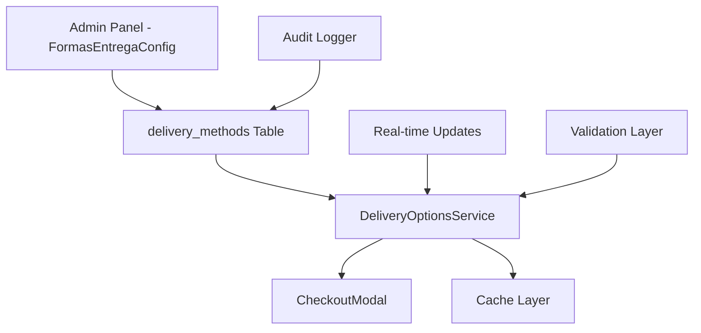

# Design Document

## Overview

Este documento descreve o design da solução para corrigir o problema de sincronização entre as configurações de formas de entrega no painel administrativo e as opções exibidas no cardápio digital. A solução garantirá que apenas as opções de entrega habilitadas sejam exibidas aos clientes, eliminando inconsistências.

## Architecture

### Current Architecture Analysis

Atualmente, o sistema possui:

1. **Tabela `delivery_methods`**: Armazena as configurações de entrega por empresa
   - `company_id`: ID da empresa
   - `delivery`: Boolean para entrega
   - `pickup`: Boolean para retirada no estabelecimento  
   - `eat_in`: Boolean para consumo no local

2. **Componente `FormasEntregaConfig`**: Interface administrativa para configurar as formas de entrega

3. **Componente `CheckoutModal`**: Interface do cliente que exibe as opções de entrega

### Problem Identification

O problema ocorre porque:
- O `CheckoutModal` consulta a tabela `delivery_methods` corretamente
- Porém, há uma lógica de fallback que pode exibir opções mesmo quando não configuradas
- Não há invalidação de cache quando as configurações são alteradas
- Falta validação consistente entre backend e frontend

### Proposed Architecture



## Components and Interfaces

### 1. DeliveryOptionsService

Novo serviço centralizado para gerenciar opções de entrega:

```typescript
interface DeliveryOptions {
  delivery: boolean;
  pickup: boolean;
  eat_in: boolean;
}

interface DeliveryOptionsService {
  // Buscar opções de entrega com cache
  getDeliveryOptions(companyId: string): Promise<DeliveryOptions>;
  
  // Atualizar opções e invalidar cache
  updateDeliveryOptions(companyId: string, options: DeliveryOptions): Promise<void>;
  
  // Validar se pelo menos uma opção está habilitada
  validateDeliveryOptions(options: DeliveryOptions): boolean;
  
  // Invalidar cache específico da empresa
  invalidateCache(companyId: string): void;
  
  // Escutar mudanças em tempo real
  subscribeToChanges(companyId: string, callback: (options: DeliveryOptions) => void): () => void;
}
```

### 2. Enhanced CheckoutModal

Melhorias no componente de checkout:

```typescript
interface CheckoutModalProps {
  // ... props existentes
  onDeliveryOptionsError?: (error: string) => void;
}

// Estados adicionais
interface CheckoutModalState {
  deliveryOptions: DeliveryOptions | null;
  isLoadingOptions: boolean;
  optionsError: string | null;
}
```

### 3. DeliveryOptionsValidator

Componente de validação:

```typescript
interface DeliveryOptionsValidator {
  // Validar se as opções são válidas
  validate(options: DeliveryOptions): ValidationResult;
  
  // Validar se a opção selecionada está disponível
  validateSelectedOption(selectedOption: string, availableOptions: DeliveryOptions): boolean;
}

interface ValidationResult {
  isValid: boolean;
  errors: string[];
  warnings: string[];
}
```

### 4. AuditLogger

Sistema de auditoria para rastrear mudanças:

```typescript
interface AuditLogger {
  logDeliveryOptionsChange(
    companyId: string,
    userId: string,
    oldOptions: DeliveryOptions,
    newOptions: DeliveryOptions
  ): Promise<void>;
  
  logSyncError(
    companyId: string,
    error: string,
    context: Record<string, any>
  ): Promise<void>;
}
```

## Data Models

### Enhanced delivery_methods Table

A tabela existente será mantida, mas com melhorias na validação:

```sql
-- Constraint para garantir pelo menos uma opção habilitada
ALTER TABLE delivery_methods 
ADD CONSTRAINT at_least_one_delivery_method_enabled 
CHECK (delivery = true OR pickup = true OR eat_in = true);

-- Índice para melhor performance
CREATE INDEX IF NOT EXISTS idx_delivery_methods_company_id 
ON delivery_methods(company_id);
```

### New audit_logs Table

Nova tabela para auditoria:

```sql
CREATE TABLE delivery_options_audit (
  id UUID PRIMARY KEY DEFAULT gen_random_uuid(),
  company_id UUID NOT NULL REFERENCES companies(id),
  user_id UUID REFERENCES auth.users(id),
  action VARCHAR(50) NOT NULL, -- 'UPDATE', 'SYNC_ERROR', etc.
  old_values JSONB,
  new_values JSONB,
  error_message TEXT,
  context JSONB,
  created_at TIMESTAMP WITH TIME ZONE DEFAULT NOW()
);
```

## Error Handling

### Error Types

1. **Configuration Errors**
   - Nenhuma forma de entrega habilitada
   - Falha ao salvar configurações
   - Configurações inválidas

2. **Sync Errors**
   - Falha na consulta das configurações
   - Cache desatualizado
   - Inconsistência entre admin e cliente

3. **Network Errors**
   - Timeout na consulta
   - Conexão perdida
   - Erro de autenticação

### Error Handling Strategy

```typescript
// Estratégia de fallback em camadas
const getDeliveryOptionsWithFallback = async (companyId: string): Promise<DeliveryOptions> => {
  try {
    // 1. Tentar buscar do cache
    const cached = await getCachedOptions(companyId);
    if (cached && !isExpired(cached)) return cached.data;
    
    // 2. Buscar do banco de dados
    const fresh = await fetchFromDatabase(companyId);
    await setCachedOptions(companyId, fresh);
    return fresh;
    
  } catch (error) {
    // 3. Log do erro
    await auditLogger.logSyncError(companyId, error.message, { source: 'getDeliveryOptions' });
    
    // 4. Fallback para configuração padrão segura
    return { delivery: false, pickup: true, eat_in: false };
  }
};
```

## Testing Strategy

### Unit Tests

1. **DeliveryOptionsService Tests**
   - Teste de cache hit/miss
   - Teste de invalidação de cache
   - Teste de validação de opções
   - Teste de fallback em caso de erro

2. **CheckoutModal Tests**
   - Renderização com diferentes configurações
   - Comportamento quando nenhuma opção está disponível
   - Teste de seleção automática da opção padrão
   - Teste de atualização em tempo real

3. **Validator Tests**
   - Validação de configurações válidas/inválidas
   - Teste de mensagens de erro
   - Teste de edge cases

### Integration Tests

1. **Admin to Client Sync**
   - Alterar configuração no admin e verificar reflexo no cliente
   - Teste de tempo de propagação das mudanças
   - Teste de múltiplas empresas simultâneas

2. **Real-time Updates**
   - Teste de WebSocket/polling para atualizações
   - Teste de reconexão após perda de conexão
   - Teste de múltiplos clientes conectados

### End-to-End Tests

1. **Complete User Journey**
   - Admin desabilita retirada → Cliente não vê a opção
   - Admin habilita delivery → Cliente vê nova opção
   - Teste com diferentes combinações de opções

## Performance Considerations

### Caching Strategy

1. **Client-side Cache**
   - Cache das opções de entrega por 5 minutos
   - Invalidação automática quando detectada mudança
   - Cache compartilhado entre componentes

2. **Server-side Cache**
   - Redis cache para consultas frequentes
   - TTL de 10 minutos com invalidação manual
   - Cache warming para empresas ativas

### Database Optimization

1. **Query Optimization**
   - Índices apropriados na tabela delivery_methods
   - Consultas preparadas para melhor performance
   - Batch queries quando possível

2. **Connection Pooling**
   - Pool de conexões otimizado para consultas frequentes
   - Timeout apropriado para evitar conexões ociosas

### Real-time Updates

1. **WebSocket Implementation**
   - Conexão WebSocket para atualizações em tempo real
   - Fallback para polling em caso de falha
   - Throttling para evitar spam de atualizações

2. **Selective Updates**
   - Apenas empresas com clientes ativos recebem updates
   - Batching de múltiplas mudanças em um período
   - Debouncing para evitar atualizações excessivas

## Security Considerations

### Access Control

1. **Row Level Security (RLS)**
   - Manter políticas existentes na tabela delivery_methods
   - Usuários só podem ver/editar configurações da própria empresa
   - Auditoria de todas as mudanças

2. **API Security**
   - Validação de permissões antes de qualquer operação
   - Rate limiting para evitar abuso
   - Sanitização de inputs

### Data Validation

1. **Input Validation**
   - Validação no frontend e backend
   - Sanitização de dados antes de salvar
   - Prevenção de injection attacks

2. **Business Logic Validation**
   - Garantir que pelo menos uma opção está habilitada
   - Validar consistência entre configurações relacionadas
   - Logs de tentativas de configurações inválidas