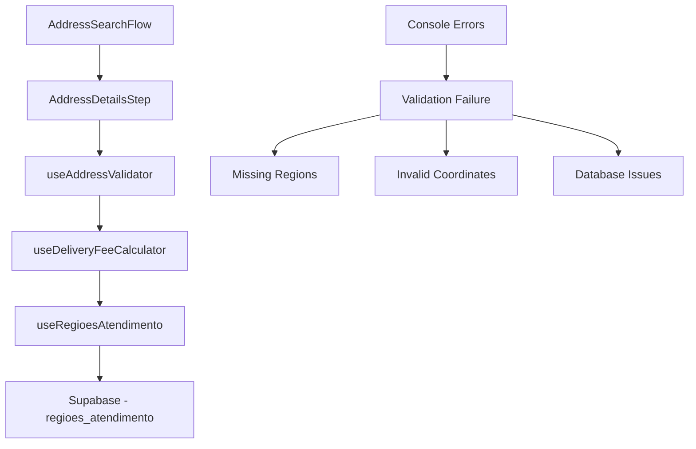

# Design Document

## Overview

Este documento detalha o design da solução para corrigir o erro que ocorre na Domínio Pizzas ao selecionar endereço no cardápio digital. Após análise do código e comparação com a 300 Graus (que funciona), identificamos que o problema está relacionado à configuração de regiões de atendimento e ao processo de validação de endereços.

## Root Cause Analysis

### Problemas Identificados

1. **Erro na Busca de Regiões**: O hook `useRegioesAtendimento` pode não estar carregando as regiões corretamente para a Domínio Pizzas
2. **Falha na Validação de Endereços**: O hook `useAddressValidator` falha durante o processo de validação geográfica
3. **Erro no Cálculo de Taxa**: O `useDeliveryFeeCalculator` pode estar gerando exceções durante o cálculo
4. **Problema de Company ID**: O ID da empresa pode não estar sendo passado corretamente no contexto do cardápio digital

### Comparação 300 Graus vs Domínio Pizzas

**300 Graus (Funciona)**:
- Regiões são carregadas corretamente pelos hooks
- Validação de endereços funciona sem erros
- Cálculo de taxa retorna valores válidos
- Company ID é passado corretamente

**Domínio Pizzas (Com Erro)**:
- Tem 7 regiões configuradas no banco (confirmado)
- Hooks podem não estar recebendo o Company ID correto
- Validação falha gerando erros no console
- Interface trava ao tentar calcular delivery

## Architecture

### Componentes Envolvidos



### Fluxo de Validação Atual

1. **Seleção de Endereço**: Cliente seleciona endereço no `AddressSearchFlow`
2. **Detalhes do Endereço**: `AddressDetailsStep` coleta informações completas
3. **Validação**: `useAddressValidator` valida se endereço está na área de atendimento
4. **Cálculo de Taxa**: `useDeliveryFeeCalculator` calcula taxa de delivery
5. **Busca de Regiões**: `useRegioesAtendimento` busca regiões no banco de dados

### Pontos de Falha Identificados

1. **Linha 1**: `useRegioesAtendimento` pode não estar recebendo o Company ID correto
2. **Linha 2**: `useAddressValidator` falha durante validação geográfica específica
3. **Linha 3**: Erros de console aparecem durante cálculo de distância ou coordenadas
4. **Linha 4**: Interface trava devido a exceções não tratadas

## Components and Interfaces

### 1. Database Layer

**Tabela: `regioes_atendimento`**
```sql
-- Estrutura esperada
CREATE TABLE regioes_atendimento (
  id UUID PRIMARY KEY,
  company_id UUID REFERENCES companies(id),
  tipo TEXT, -- 'raio', 'bairro', 'cep'
  nome TEXT,
  centro_lat DECIMAL,
  centro_lng DECIMAL,
  raio_km DECIMAL,
  valor DECIMAL,
  status BOOLEAN DEFAULT true
);
```

### 2. Hook Layer

**useRegioesAtendimento**
- Responsável por buscar regiões do banco
- Implementa fallback automático quando não há regiões
- Cria região universal baseada na configuração da 300 Graus

**useDeliveryFeeCalculator**
- Calcula taxa baseado nas regiões disponíveis
- Implementa múltiplas estratégias de cálculo
- Retorna 0 como fallback seguro

**useAddressValidator**
- Valida se endereço está na área de atendimento
- Usa coordenadas geográficas para validação
- Retorna resultado estruturado com taxa

### 3. Component Layer

**AddressDetailsStep**
- Coleta informações completas do endereço
- Chama validação antes de confirmar
- Exibe erros de forma clara ao usuário

## Data Models

### RegiaoAtendimento Interface
```typescript
interface RegiaoAtendimento {
  id: string;
  company_id: string;
  tipo: 'raio' | 'bairro' | 'cep';
  nome?: string;
  centro_lat?: number;
  centro_lng?: number;
  raio_km?: number;
  valor: number;
  status: boolean;
}
```

### ValidationResult Interface
```typescript
interface ValidationResult {
  isValid: boolean;
  message?: string;
  fee?: number;
}
```

### CustomerAddress Interface
```typescript
interface CustomerAddress {
  cep: string;
  logradouro: string;
  numero: string;
  complemento?: string;
  bairro: string;
  cidade: string;
  estado: string;
  latitude?: number;
  longitude?: number;
  deliveryFee?: number;
}
```

## Error Handling

### 1. Estratégia de Fallback em Camadas

**Nível 1 - Região Específica**: Buscar região exata por bairro/coordenadas
**Nível 2 - Região Universal**: Criar região automática com raio amplo
**Nível 3 - Região de Emergência**: Região em memória como último recurso

### 2. Tratamento de Erros por Componente

**useRegioesAtendimento**:
- Se não há regiões: Criar região universal automaticamente
- Se erro de banco: Usar região em memória
- Se company_id inválido: Log de warning e retorno vazio

**useAddressValidator**:
- Se não há coordenadas: Tentar geocoding automático
- Se validação falha: Retornar erro estruturado
- Se não há regiões: Permitir com taxa 0

**AddressDetailsStep**:
- Exibir mensagens de erro claras
- Permitir retry da validação
- Não bloquear interface em caso de erro

### 3. Logging e Debugging

```typescript
// Logs estruturados para debugging
console.log('🔍 Validando endereço:', address);
console.log('🏪 Company ID:', companyId);
console.log('📍 Regiões configuradas:', regioes);
console.log('✅ Endereço validado - Taxa:', validation.fee);
```

## Testing Strategy

### 1. Testes de Integração

**Cenário 1**: Domínio Pizzas sem regiões configuradas
- Verificar criação automática de região universal
- Validar que endereços são aceitos com taxa 0
- Confirmar que não há erros de console

**Cenário 2**: Domínio Pizzas com regiões configuradas
- Verificar cálculo correto de taxas
- Validar rejeição de endereços fora da área
- Confirmar funcionamento igual à 300 Graus

**Cenário 3**: Endereços com e sem coordenadas
- Testar geocoding automático
- Validar fallbacks de validação
- Confirmar experiência do usuário fluida

### 2. Testes de Comparação

**300 Graus vs Domínio Pizzas**:
- Mesmos endereços devem ter comportamento similar
- Taxas devem ser calculadas corretamente
- Erros devem ser tratados de forma consistente

### 3. Testes de Erro

**Cenários de Falha**:
- Banco de dados indisponível
- API de geocoding falhando
- Coordenadas inválidas
- Company ID inexistente

### 4. Testes de Performance

**Métricas**:
- Tempo de validação de endereço < 2s
- Carregamento de regiões < 1s
- Resposta da interface < 500ms

## Implementation Phases

### Fase 1: Diagnóstico e Correção Imediata
- Verificar configuração atual da Domínio Pizzas
- Implementar região universal como fallback
- Corrigir erros de console imediatos

### Fase 2: Padronização e Robustez
- Padronizar configurações entre empresas
- Implementar tratamento de erros robusto
- Adicionar logs detalhados para debugging

### Fase 3: Otimização e Monitoramento
- Otimizar performance de validação
- Implementar monitoramento de erros
- Adicionar métricas de sucesso

## Success Criteria

1. **Funcionalidade**: Domínio Pizzas deve funcionar igual à 300 Graus
2. **Confiabilidade**: Zero erros de console durante seleção de endereço
3. **Performance**: Validação de endereço em menos de 2 segundos
4. **Experiência**: Interface fluida sem travamentos
5. **Consistência**: Comportamento idêntico entre todas as empresas