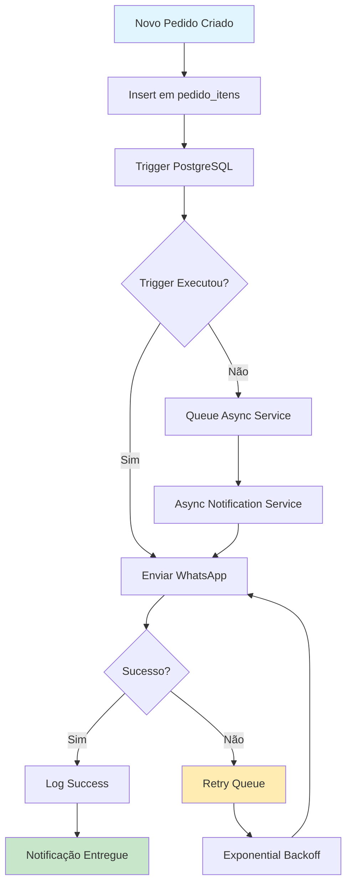

# Design Document - Notificações WhatsApp

## Overview

Este documento descreve o design para implementar um sistema robusto e confiável de notificações WhatsApp automáticas quando pedidos são criados. O sistema atual depende de triggers PostgreSQL que têm se mostrado instáveis, causando falhas no envio de notificações mesmo com a API WhatsApp funcionando corretamente.

A solução proposta implementa uma arquitetura híbrida que combina triggers como mecanismo primário com um sistema de fallback baseado em processamento assíncrono, garantindo que as notificações sejam sempre enviadas.

## Architecture

### Componentes Principais

1. **Trigger System (Primário)**
   - Triggers PostgreSQL otimizados na tabela `pedido_itens`
   - Função de notificação com controle de duplicação
   - Logs detalhados para debugging

2. **Async Notification Service (Fallback)**
   - Serviço Node.js/TypeScript para processamento assíncrono
   - Queue system para garantir entrega
   - Retry mechanism com backoff exponencial

3. **WhatsApp Integration Layer**
   - Abstração da API WhatsApp existente
   - Suporte a múltiplas integrações por empresa
   - Rate limiting e error handling

4. **Monitoring & Logging**
   - Sistema de logs centralizado
   - Métricas de entrega
   - Alertas para falhas

### Fluxo de Dados



## Components and Interfaces

### 1. Database Layer

#### Trigger Function
```sql
CREATE OR REPLACE FUNCTION send_whatsapp_notification_after_items()
RETURNS TRIGGER AS $$
DECLARE
    v_pedido_record RECORD;
    v_total_itens INTEGER;
    v_notification_sent BOOLEAN DEFAULT FALSE;
BEGIN
    -- Controle de duplicação: só executa no primeiro item
    SELECT COUNT(*) INTO v_total_itens
    FROM pedido_itens 
    WHERE pedido_id = NEW.pedido_id;
    
    IF v_total_itens = 1 THEN
        -- Buscar dados do pedido
        SELECT p.*, c.name as company_name, c.whatsapp_config
        INTO v_pedido_record
        FROM pedidos p
        JOIN companies c ON p.company_id = c.id
        WHERE p.id = NEW.pedido_id;
        
        -- Tentar enviar notificação
        SELECT send_whatsapp_message(v_pedido_record) INTO v_notification_sent;
        
        -- Se falhar, adicionar à queue assíncrona
        IF NOT v_notification_sent THEN
            INSERT INTO notification_queue (pedido_id, type, status, created_at)
            VALUES (NEW.pedido_id, 'whatsapp_order_confirmation', 'pending', NOW());
        END IF;
        
        -- Log da operação
        INSERT INTO notification_logs (pedido_id, type, status, details, created_at)
        VALUES (NEW.pedido_id, 'whatsapp_trigger', 
                CASE WHEN v_notification_sent THEN 'success' ELSE 'failed' END,
                jsonb_build_object('trigger_executed', true, 'sent', v_notification_sent),
                NOW());
    END IF;
    
    RETURN NEW;
END;
$$ LANGUAGE plpgsql SECURITY DEFINER;
```

#### Tabelas de Suporte
```sql
-- Queue para processamento assíncrono
CREATE TABLE notification_queue (
    id UUID PRIMARY KEY DEFAULT gen_random_uuid(),
    pedido_id UUID NOT NULL REFERENCES pedidos(id),
    type VARCHAR(50) NOT NULL,
    status VARCHAR(20) DEFAULT 'pending',
    retry_count INTEGER DEFAULT 0,
    max_retries INTEGER DEFAULT 3,
    next_retry_at TIMESTAMP,
    payload JSONB,
    created_at TIMESTAMP DEFAULT NOW(),
    updated_at TIMESTAMP DEFAULT NOW()
);

-- Logs detalhados
CREATE TABLE notification_logs (
    id UUID PRIMARY KEY DEFAULT gen_random_uuid(),
    pedido_id UUID REFERENCES pedidos(id),
    type VARCHAR(50) NOT NULL,
    status VARCHAR(20) NOT NULL,
    details JSONB,
    created_at TIMESTAMP DEFAULT NOW()
);
```

### 2. Async Notification Service

#### Interface Principal
```typescript
interface NotificationService {
    processQueue(): Promise<void>;
    sendWhatsAppNotification(pedidoId: string): Promise<boolean>;
    retryFailedNotifications(): Promise<void>;
    getNotificationStatus(pedidoId: string): Promise<NotificationStatus>;
}

interface NotificationStatus {
    pedidoId: string;
    status: 'pending' | 'sent' | 'failed' | 'retry';
    attempts: number;
    lastAttempt?: Date;
    nextRetry?: Date;
    error?: string;
}
```

#### Implementação do Serviço
```typescript
class WhatsAppNotificationService implements NotificationService {
    private whatsappClient: WhatsAppClient;
    private database: Database;
    private logger: Logger;
    
    async processQueue(): Promise<void> {
        const pendingNotifications = await this.database.query(`
            SELECT * FROM notification_queue 
            WHERE status = 'pending' 
            AND (next_retry_at IS NULL OR next_retry_at <= NOW())
            ORDER BY created_at ASC
            LIMIT 10
        `);
        
        for (const notification of pendingNotifications) {
            await this.processNotification(notification);
        }
    }
    
    private async processNotification(notification: QueueItem): Promise<void> {
        try {
            const success = await this.sendWhatsAppNotification(notification.pedido_id);
            
            if (success) {
                await this.markAsSuccess(notification.id);
            } else {
                await this.scheduleRetry(notification);
            }
        } catch (error) {
            await this.handleError(notification, error);
        }
    }
    
    private async scheduleRetry(notification: QueueItem): Promise<void> {
        const nextRetry = this.calculateBackoff(notification.retry_count);
        
        await this.database.query(`
            UPDATE notification_queue 
            SET retry_count = retry_count + 1,
                next_retry_at = $1,
                status = CASE 
                    WHEN retry_count + 1 >= max_retries THEN 'failed'
                    ELSE 'retry'
                END
            WHERE id = $2
        `, [nextRetry, notification.id]);
    }
    
    private calculateBackoff(retryCount: number): Date {
        // Exponential backoff: 1min, 5min, 15min, 30min
        const delays = [60, 300, 900, 1800];
        const delay = delays[Math.min(retryCount, delays.length - 1)];
        return new Date(Date.now() + delay * 1000);
    }
}
```

### 3. WhatsApp Integration Layer

#### Abstração da API
```typescript
interface WhatsAppClient {
    sendMessage(companyId: string, phone: string, message: string): Promise<boolean>;
    getIntegrationConfig(companyId: string): Promise<WhatsAppConfig>;
    validatePhone(phone: string): boolean;
}

interface WhatsAppConfig {
    apiUrl: string;
    apiKey: string;
    enabled: boolean;
    rateLimitPerMinute: number;
}

class WhatsAppClientImpl implements WhatsAppClient {
    async sendMessage(companyId: string, phone: string, message: string): Promise<boolean> {
        const config = await this.getIntegrationConfig(companyId);
        
        if (!config.enabled) {
            this.logger.warn(`WhatsApp disabled for company ${companyId}`);
            return false;
        }
        
        if (!this.validatePhone(phone)) {
            this.logger.error(`Invalid phone number: ${phone}`);
            return false;
        }
        
        try {
            const response = await fetch(`${config.apiUrl}/send`, {
                method: 'POST',
                headers: {
                    'Authorization': `Bearer ${config.apiKey}`,
                    'Content-Type': 'application/json'
                },
                body: JSON.stringify({
                    phone,
                    message,
                    companyId
                })
            });
            
            return response.ok;
        } catch (error) {
            this.logger.error('WhatsApp API error:', error);
            return false;
        }
    }
}
```

## Data Models

### Notification Queue Model
```typescript
interface NotificationQueueItem {
    id: string;
    pedidoId: string;
    type: 'whatsapp_order_confirmation' | 'whatsapp_status_update';
    status: 'pending' | 'processing' | 'sent' | 'failed' | 'retry';
    retryCount: number;
    maxRetries: number;
    nextRetryAt?: Date;
    payload?: Record<string, any>;
    createdAt: Date;
    updatedAt: Date;
}
```

### Notification Log Model
```typescript
interface NotificationLog {
    id: string;
    pedidoId: string;
    type: string;
    status: 'success' | 'failed' | 'retry';
    details: {
        triggerExecuted?: boolean;
        sent?: boolean;
        error?: string;
        retryCount?: number;
        apiResponse?: any;
    };
    createdAt: Date;
}
```

### Message Template Model
```typescript
interface MessageTemplate {
    companyId: string;
    type: 'order_confirmation' | 'status_update';
    template: string;
    variables: string[];
    enabled: boolean;
}
```

## Error Handling

### Estratégias de Recuperação

1. **Trigger Failures**
   - Fallback automático para queue assíncrona
   - Log detalhado do erro
   - Alertas para administradores

2. **API Failures**
   - Retry com backoff exponencial
   - Rate limiting respeitado
   - Fallback para diferentes provedores se disponível

3. **Database Failures**
   - Transações atômicas
   - Rollback em caso de erro
   - Logs persistentes

### Error Categories
```typescript
enum NotificationErrorType {
    TRIGGER_FAILED = 'trigger_failed',
    API_UNAVAILABLE = 'api_unavailable',
    INVALID_PHONE = 'invalid_phone',
    RATE_LIMITED = 'rate_limited',
    CONFIG_MISSING = 'config_missing',
    NETWORK_ERROR = 'network_error'
}

interface NotificationError {
    type: NotificationErrorType;
    message: string;
    retryable: boolean;
    details?: Record<string, any>;
}
```

## Testing Strategy

### Unit Tests
- Função de trigger PostgreSQL
- Serviço de notificações assíncronas
- Cliente WhatsApp
- Lógica de retry e backoff

### Integration Tests
- Fluxo completo trigger → API WhatsApp
- Fallback para processamento assíncrono
- Múltiplas integrações WhatsApp
- Cenários de falha e recuperação

### End-to-End Tests
- Criação de pedido → notificação entregue
- Teste com diferentes empresas
- Teste de volume (múltiplos pedidos simultâneos)
- Teste de resiliência (API indisponível)

### Performance Tests
- Throughput do sistema de notificações
- Latência de entrega
- Comportamento sob carga
- Memory leaks no serviço assíncrono

### Monitoring Tests
- Alertas funcionando corretamente
- Métricas sendo coletadas
- Logs sendo persistidos
- Dashboard atualizado em tempo real

## Implementation Phases

### Fase 1: Estabilização dos Triggers
- Corrigir função de trigger existente
- Implementar controle de duplicação robusto
- Adicionar logs detalhados
- Testes unitários da função

### Fase 2: Sistema de Queue Assíncrona
- Criar tabelas de suporte
- Implementar serviço de processamento
- Sistema de retry com backoff
- Monitoramento básico

### Fase 3: Integração e Fallback
- Conectar trigger com queue
- Implementar fallback automático
- Testes de integração
- Alertas para falhas

### Fase 4: Monitoramento Avançado
- Dashboard de métricas
- Alertas inteligentes
- Análise de performance
- Otimizações baseadas em dados