# Design Document - Correção do Sistema de Tempo Real WhatsApp

## Overview

Este documento descreve o design para diagnosticar e corrigir os problemas de atualização em tempo real das mensagens WhatsApp. Após análise do código existente, identifiquei várias áreas problemáticas que impedem o funcionamento adequado do sistema de tempo real:

1. **Configuração do Supabase Realtime**: Possíveis problemas com políticas RLS muito restritivas
2. **Filtros de Company ID**: Filtros aplicados incorretamente nas subscriptions
3. **Cleanup de Canais**: Problemas de memory leaks e reconexões
4. **Sistema de Fallback**: Polling muito agressivo mascarando problemas reais
5. **Gerenciamento de Estado**: Race conditions entre realtime e polling

A solução proposta implementa uma abordagem sistemática de diagnóstico e correção, com melhorias na arquitetura de tempo real.

## Architecture

### Componentes Principais

1. **Diagnostic Service**
   - Verificação de configuração do Supabase Realtime
   - Teste de conectividade WebSocket
   - Validação de políticas RLS
   - Monitoramento de performance

2. **Enhanced Realtime Hook**
   - Gerenciamento inteligente de conexões
   - Fallback automático e transparente
   - Cleanup adequado de recursos
   - Debouncing de eventos

3. **Connection Manager**
   - Monitoramento de status de conexão
   - Reconexão automática com backoff
   - Métricas de qualidade de conexão
   - Alertas para problemas persistentes

4. **Message Synchronization Service**
   - Sincronização de mensagens perdidas
   - Detecção de gaps no histórico
   - Resolução de conflitos
   - Cache inteligente

### Fluxo de Dados Otimizado

```mermaid
graph TD
    A[Nova Mensagem WhatsApp] --> B[Webhook/API]
    B --> C[Insert em whatsapp_messages]
    C --> D[Supabase Realtime]
    D --> E{WebSocket Ativo?}
    E -->|Sim| F[Enviar via WebSocket]
    E -->|Não| G[Queue para Polling]
    F --> H[useWhatsAppRealtime Hook]
    G --> I[Polling Service]
    I --> H
    H --> J[Atualizar Estado Local]
    J --> K[Mostrar na Interface]
    
    L[Diagnostic Service] --> M{Problemas Detectados?}
    M -->|Sim| N[Aplicar Correções]
    M -->|Não| O[Monitoramento Contínuo]
    N --> P[Reiniciar Conexões]
    P --> D
    
    style A fill:#e1f5fe
    style K fill:#c8e6c9
    style L fill:#fff3e0
    style N fill:#ffecb3
```



## Components and Interfaces

### 1. Diagnostic Service

#### Interface Principal
```typescript
interface DiagnosticService {
  runFullDiagnostic(): Promise<DiagnosticReport>;
  checkRealtimeConfig(): Promise<RealtimeConfigStatus>;
  checkRLSPolicies(): Promise<RLSPolicyStatus>;
  checkWebSocketConnection(): Promise<WebSocketStatus>;
  fixCommonIssues(): Promise<FixResult[]>;
}

interface DiagnosticReport {
  timestamp: Date;
  overallStatus: 'healthy' | 'warning' | 'critical';
  issues: DiagnosticIssue[];
  recommendations: string[];
  metrics: {
    connectionLatency: number;
    messageDeliveryRate: number;
    errorRate: number;
  };
}

interface DiagnosticIssue {
  severity: 'low' | 'medium' | 'high' | 'critical';
  category: 'realtime' | 'rls' | 'websocket' | 'performance';
  description: string;
  solution: string;
  autoFixable: boolean;
}
```

#### Implementação do Serviço
```typescript
class WhatsAppRealtimeDiagnostic implements DiagnosticService {
  private supabase: SupabaseClient;
  private logger: Logger;
  
  async runFullDiagnostic(): Promise<DiagnosticReport> {
    const issues: DiagnosticIssue[] = [];
    const startTime = Date.now();
    
    // 1. Verificar configuração de realtime
    const realtimeStatus = await this.checkRealtimeConfig();
    if (!realtimeStatus.isConfigured) {
      issues.push({
        severity: 'critical',
        category: 'realtime',
        description: 'Tabelas WhatsApp não estão na publicação supabase_realtime',
        solution: 'Executar ALTER PUBLICATION supabase_realtime ADD TABLE whatsapp_messages, whatsapp_chats',
        autoFixable: true
      });
    }
    
    // 2. Verificar políticas RLS
    const rlsStatus = await this.checkRLSPolicies();
    if (rlsStatus.tooRestrictive) {
      issues.push({
        severity: 'high',
        category: 'rls',
        description: 'Políticas RLS muito restritivas impedem realtime',
        solution: 'Criar políticas permissivas para realtime ou usar filtros manuais',
        autoFixable: true
      });
    }
    
    // 3. Testar conexão WebSocket
    const wsStatus = await this.checkWebSocketConnection();
    if (!wsStatus.connected) {
      issues.push({
        severity: 'high',
        category: 'websocket',
        description: 'Falha na conexão WebSocket com Supabase',
        solution: 'Verificar configuração de rede e certificados SSL',
        autoFixable: false
      });
    }
    
    // 4. Verificar performance
    const metrics = await this.collectMetrics();
    if (metrics.messageDeliveryRate < 0.95) {
      issues.push({
        severity: 'medium',
        category: 'performance',
        description: `Taxa de entrega baixa: ${(metrics.messageDeliveryRate * 100).toFixed(1)}%`,
        solution: 'Otimizar filtros e reduzir polling agressivo',
        autoFixable: true
      });
    }
    
    return {
      timestamp: new Date(),
      overallStatus: this.calculateOverallStatus(issues),
      issues,
      recommendations: this.generateRecommendations(issues),
      metrics: {
        ...metrics,
        connectionLatency: Date.now() - startTime
      }
    };
  }
  
  async fixCommonIssues(): Promise<FixResult[]> {
    const results: FixResult[] = [];
    
    // Fix 1: Garantir que tabelas estão na publicação realtime
    try {
      await this.supabase.rpc('ensure_whatsapp_realtime_publication');
      results.push({
        issue: 'realtime_publication',
        success: true,
        message: 'Tabelas adicionadas à publicação realtime'
      });
    } catch (error) {
      results.push({
        issue: 'realtime_publication',
        success: false,
        message: `Erro ao configurar publicação: ${error.message}`
      });
    }
    
    // Fix 2: Criar políticas RLS otimizadas
    try {
      await this.createOptimizedRLSPolicies();
      results.push({
        issue: 'rls_policies',
        success: true,
        message: 'Políticas RLS otimizadas criadas'
      });
    } catch (error) {
      results.push({
        issue: 'rls_policies',
        success: false,
        message: `Erro ao criar políticas: ${error.message}`
      });
    }
    
    return results;
  }
  
  private async createOptimizedRLSPolicies(): Promise<void> {
    // Remover políticas muito restritivas
    await this.supabase.rpc('drop_restrictive_whatsapp_policies');
    
    // Criar políticas otimizadas para realtime
    await this.supabase.rpc('create_optimized_whatsapp_policies');
  }
}
```

### 2. Enhanced Realtime Hook

#### Interface Melhorada
```typescript
interface EnhancedRealtimeHook {
  connectionStatus: ConnectionStatus;
  messageQueue: Message[];
  diagnostics: RealtimeDiagnostics;
  forceReconnect: () => void;
  runDiagnostic: () => Promise<DiagnosticReport>;
  clearMessageQueue: () => void;
}

interface ConnectionStatus {
  isConnected: boolean;
  isReconnecting: boolean;
  lastConnected: Date | null;
  retryCount: number;
  quality: 'excellent' | 'good' | 'poor' | 'critical';
  latency: number;
}

interface RealtimeDiagnostics {
  messagesReceived: number;
  messagesLost: number;
  reconnections: number;
  averageLatency: number;
  lastError: string | null;
}
```

#### Implementação Otimizada
```typescript
export const useWhatsAppRealtimeEnhanced = ({ 
  companyId, 
  onNewMessage,
  onChatUpdate 
}: UseWhatsAppRealtimeProps) => {
  const [connectionStatus, setConnectionStatus] = useState<ConnectionStatus>({
    isConnected: false,
    isReconnecting: false,
    lastConnected: null,
    retryCount: 0,
    quality: 'critical',
    latency: 0
  });
  
  const [diagnostics, setDiagnostics] = useState<RealtimeDiagnostics>({
    messagesReceived: 0,
    messagesLost: 0,
    reconnections: 0,
    averageLatency: 0,
    lastError: null
  });
  
  const channelsRef = useRef<RealtimeChannel[]>([]);
  const messageQueueRef = useRef<Message[]>([]);
  const diagnosticService = useRef(new WhatsAppRealtimeDiagnostic(supabase));
  const reconnectTimeoutRef = useRef<NodeJS.Timeout>();
  const pollingIntervalRef = useRef<NodeJS.Timeout>();
  const isUnmountedRef = useRef(false);
  
  // Debounce para evitar múltiplas atualizações
  const debouncedMessageHandler = useMemo(
    () => debounce((message: any) => {
      if (isUnmountedRef.current) return;
      
      // Verificar se mensagem já foi processada
      const messageId = message.message_id || message.id;
      const alreadyProcessed = messageQueueRef.current.some(m => m.id === messageId);
      
      if (!alreadyProcessed) {
        messageQueueRef.current.push(message);
        onNewMessage?.(message);
        
        setDiagnostics(prev => ({
          ...prev,
          messagesReceived: prev.messagesReceived + 1
        }));
      }
    }, 100),
    [onNewMessage]
  );
  
  // Configurar subscriptions com diagnóstico
  const setupRealtimeSubscriptions = useCallback(async () => {
    if (!companyId || isUnmountedRef.current) return;
    
    // Executar diagnóstico antes de conectar
    const diagnostic = await diagnosticService.current.runFullDiagnostic();
    
    if (diagnostic.overallStatus === 'critical') {
      console.error('🚨 Problemas críticos detectados:', diagnostic.issues);
      
      // Tentar correções automáticas
      const fixes = await diagnosticService.current.fixCommonIssues();
      console.log('🔧 Correções aplicadas:', fixes);
    }
    
    // Cleanup de canais anteriores
    cleanupChannels();
    
    const startTime = Date.now();
    
    // Canal para mensagens com configuração otimizada
    const messagesChannel = supabase
      .channel(`whatsapp_messages_${companyId}_${Date.now()}`)
      .on(
        'postgres_changes',
        {
          event: 'INSERT',
          schema: 'public',
          table: 'whatsapp_messages'
          // Remover filtro aqui - fazer filtragem manual para melhor performance
        },
        (payload) => {
          const latency = Date.now() - startTime;
          
          // Filtrar manualmente por company_id
          if (payload.new?.company_id === companyId) {
            debouncedMessageHandler(payload.new);
            
            // Atualizar métricas de latência
            setDiagnostics(prev => ({
              ...prev,
              averageLatency: (prev.averageLatency + latency) / 2
            }));
          }
        }
      )
      .on(
        'postgres_changes',
        {
          event: 'UPDATE',
          schema: 'public',
          table: 'whatsapp_messages'
        },
        (payload) => {
          if (payload.new?.company_id === companyId) {
            debouncedMessageHandler(payload.new);
          }
        }
      );
    
    // Canal para chats
    const chatsChannel = supabase
      .channel(`whatsapp_chats_${companyId}_${Date.now()}`)
      .on(
        'postgres_changes',
        {
          event: '*',
          schema: 'public',
          table: 'whatsapp_chats'
        },
        (payload) => {
          const chatData = payload.new || payload.old;
          if (chatData?.company_id === companyId) {
            onChatUpdate?.(payload);
          }
        }
      );
    
    // Gerenciar status de conexão
    const handleSubscriptionStatus = (status: string, channel: RealtimeChannel) => {
      const now = new Date();
      
      if (status === 'SUBSCRIBED') {
        setConnectionStatus(prev => ({
          ...prev,
          isConnected: true,
          isReconnecting: false,
          lastConnected: now,
          retryCount: 0,
          quality: 'excellent'
        }));
        
        // Parar polling quando realtime funciona
        if (pollingIntervalRef.current) {
          clearInterval(pollingIntervalRef.current);
          pollingIntervalRef.current = undefined;
        }
        
      } else if (status === 'CHANNEL_ERROR' || status === 'TIMED_OUT') {
        setConnectionStatus(prev => ({
          ...prev,
          isConnected: false,
          quality: 'critical'
        }));
        
        setDiagnostics(prev => ({
          ...prev,
          lastError: `Connection error: ${status}`
        }));
        
        // Iniciar polling como fallback
        startPollingFallback();
        
        // Tentar reconectar
        if (connectionStatus.retryCount < 5) {
          scheduleReconnection();
        }
      }
    };
    
    // Subscribe nos canais
    messagesChannel.subscribe((status) => handleSubscriptionStatus(status, messagesChannel));
    chatsChannel.subscribe((status) => handleSubscriptionStatus(status, chatsChannel));
    
    channelsRef.current = [messagesChannel, chatsChannel];
    
  }, [companyId, onNewMessage, onChatUpdate, debouncedMessageHandler]);
  
  // Polling como fallback (menos agressivo)
  const startPollingFallback = useCallback(() => {
    if (pollingIntervalRef.current) return;
    
    console.log('🔄 Iniciando polling fallback');
    
    pollingIntervalRef.current = setInterval(async () => {
      if (isUnmountedRef.current || connectionStatus.isConnected) return;
      
      try {
        const { data: recentMessages } = await supabase
          .from('whatsapp_messages')
          .select('*')
          .eq('company_id', companyId)
          .order('timestamp', { ascending: false })
          .limit(5);
        
        if (recentMessages?.length > 0) {
          recentMessages.forEach(message => {
            debouncedMessageHandler(message);
          });
        }
      } catch (error) {
        console.warn('Erro no polling fallback:', error);
      }
    }, 5000); // 5 segundos - menos agressivo
  }, [companyId, connectionStatus.isConnected, debouncedMessageHandler]);
  
  // Reconexão com backoff exponencial
  const scheduleReconnection = useCallback(() => {
    if (isUnmountedRef.current) return;
    
    const delay = Math.min(1000 * Math.pow(2, connectionStatus.retryCount), 30000);
    
    setConnectionStatus(prev => ({
      ...prev,
      isReconnecting: true,
      retryCount: prev.retryCount + 1
    }));
    
    setDiagnostics(prev => ({
      ...prev,
      reconnections: prev.reconnections + 1
    }));
    
    reconnectTimeoutRef.current = setTimeout(() => {
      if (!isUnmountedRef.current) {
        setupRealtimeSubscriptions();
      }
    }, delay);
  }, [connectionStatus.retryCount, setupRealtimeSubscriptions]);
  
  // Cleanup de canais
  const cleanupChannels = useCallback(() => {
    channelsRef.current.forEach(channel => {
      try {
        supabase.removeChannel(channel);
      } catch (error) {
        console.warn('Erro ao remover canal:', error);
      }
    });
    channelsRef.current = [];
  }, []);
  
  // Executar diagnóstico manual
  const runDiagnostic = useCallback(async () => {
    return await diagnosticService.current.runFullDiagnostic();
  }, []);
  
  // Forçar reconexão
  const forceReconnect = useCallback(() => {
    cleanupChannels();
    setConnectionStatus(prev => ({ ...prev, retryCount: 0 }));
    setupRealtimeSubscriptions();
  }, [cleanupChannels, setupRealtimeSubscriptions]);
  
  // Inicialização
  useEffect(() => {
    if (!companyId) return;
    
    setupRealtimeSubscriptions();
    
    return () => {
      isUnmountedRef.current = true;
      cleanupChannels();
      
      if (reconnectTimeoutRef.current) {
        clearTimeout(reconnectTimeoutRef.current);
      }
      
      if (pollingIntervalRef.current) {
        clearInterval(pollingIntervalRef.current);
      }
    };
  }, [companyId, setupRealtimeSubscriptions, cleanupChannels]);
  
  return {
    connectionStatus,
    messageQueue: messageQueueRef.current,
    diagnostics,
    forceReconnect,
    runDiagnostic,
    clearMessageQueue: () => { messageQueueRef.current = []; },
    isConnected: connectionStatus.isConnected,
    isReconnecting: connectionStatus.isReconnecting
  };
};
```

## Data Models

### Diagnostic Models
```typescript
interface RealtimeConfigStatus {
  isConfigured: boolean;
  tablesInPublication: string[];
  missingTables: string[];
  replicaIdentity: Record<string, string>;
}

interface RLSPolicyStatus {
  enabled: boolean;
  policies: RLSPolicy[];
  tooRestrictive: boolean;
  recommendations: string[];
}

interface RLSPolicy {
  tableName: string;
  policyName: string;
  permissive: boolean;
  roles: string[];
  command: string;
  expression: string;
}

interface WebSocketStatus {
  connected: boolean;
  latency: number;
  lastError: string | null;
  supportedProtocols: string[];
}

interface FixResult {
  issue: string;
  success: boolean;
  message: string;
  details?: any;
}
```

## Error Handling

### Estratégias de Recuperação

1. **Falhas de Conexão WebSocket**
   - Fallback automático para polling
   - Reconexão com backoff exponencial
   - Notificação visual do status

2. **Problemas de Configuração**
   - Diagnóstico automático na inicialização
   - Correções automáticas quando possível
   - Alertas para problemas que requerem intervenção manual

3. **Perda de Mensagens**
   - Detecção de gaps no histórico
   - Sincronização automática de mensagens perdidas
   - Queue local para mensagens não confirmadas

4. **Problemas de Performance**
   - Monitoramento de métricas em tempo real
   - Ajuste automático de intervalos de polling
   - Otimização de filtros baseada em uso

## Testing Strategy

### Unit Tests
- Serviço de diagnóstico
- Hook de realtime otimizado
- Gerenciador de conexões
- Utilitários de sincronização

### Integration Tests
- Fluxo completo de mensagens
- Fallback polling → realtime
- Reconexão após falhas
- Sincronização de mensagens perdidas

### End-to-End Tests
- Cenários de uso real com múltiplos usuários
- Teste de resiliência com falhas simuladas
- Performance sob carga
- Compatibilidade entre navegadores

### Performance Tests
- Latência de entrega de mensagens
- Throughput do sistema
- Memory usage e leaks
- Comportamento com muitas conexões simultâneas

## Implementation Phases

### Fase 1: Diagnóstico e Correção
- Implementar serviço de diagnóstico
- Identificar e corrigir problemas de configuração
- Otimizar políticas RLS
- Testes de conectividade

### Fase 2: Hook Otimizado
- Refatorar useWhatsAppRealtime
- Implementar debouncing e cleanup adequado
- Adicionar métricas e monitoramento
- Sistema de fallback inteligente

### Fase 3: Interface e UX
- Indicadores visuais de status de conexão
- Notificações de problemas
- Controles para diagnóstico manual
- Métricas para usuários

### Fase 4: Monitoramento e Alertas
- Dashboard de saúde do sistema
- Alertas automáticos para problemas
- Logs estruturados
- Análise de performance contínua