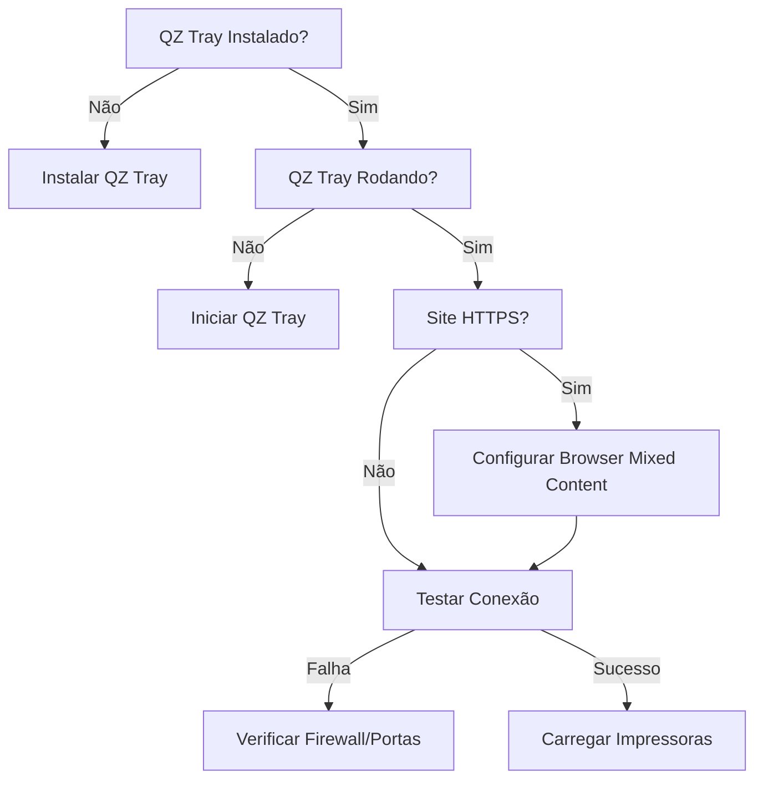

# 🖨️ Solução Completa - QZ Tray Integration

## 🚨 Problema Identificado
**Erro:** "QZ Tray não encontrado na porta 8181. Certifique-se de que está rodando."

### Causa Principal
Site HTTPS tentando conectar com QZ Tray local (HTTP/HTTPS) causa bloqueio de "Mixed Content" no browser.

## ✅ Solução Passo a Passo

### 1️⃣ Instalar QZ Tray
1. Baixe em: https://qz.io/download/
2. Instale seguindo o assistente
3. Após instalação, verifique se o ícone aparece na bandeja do sistema
4. O QZ Tray deve estar rodando (ícone visível)

### 2️⃣ Configurar o Browser (OBRIGATÓRIO para HTTPS)

#### **Google Chrome**
1. Acesse o site: https://78f1b2d4-13ce-4fc8-8fc4-25d4ea8904e3.lovableproject.com/settings/impressao-qz-tray
2. Clique no ícone 🔒 (cadeado) na barra de endereços
3. Clique em "Site settings" (Configurações do site)
4. Procure por "Insecure content" (Conteúdo não seguro)
5. Mude de "Block (default)" para **"Allow"**
6. Recarregue a página (F5)

#### **Microsoft Edge**
1. Clique nos três pontos (...) → Settings
2. Vá em "Cookies and site permissions"
3. Procure "Insecure content"
4. Adicione o site nas exceções para permitir
5. Recarregue a página

#### **Firefox**
1. Digite na barra de endereços: `about:config`
2. Aceite o aviso
3. Procure por: `security.mixed_content.block_active_content`
4. Mude para `false`
5. Recarregue a página

### 3️⃣ Verificar Portas

Execute no PowerShell/CMD como administrador:
```bash
netstat -an | findstr "818"
```

Você deve ver:
```
TCP    127.0.0.1:8181    0.0.0.0:0    LISTENING
TCP    127.0.0.1:8182    0.0.0.0:0    LISTENING
```

### 4️⃣ Firewall/Antivírus

1. **Windows Defender Firewall:**
   - Painel de Controle → Sistema e Segurança → Windows Defender Firewall
   - "Permitir um aplicativo" → Adicione QZ Tray
   - Marque "Privada" e "Pública"

2. **Antivírus:**
   - Adicione exceção para QZ Tray
   - Portas 8181 e 8182
   - Pasta de instalação (geralmente C:\Program Files\QZ Tray)

### 5️⃣ Teste de Conexão

1. No site, clique em **"Executar Diagnóstico Completo"**
2. Verifique o resultado de cada teste
3. Se algum falhar, siga as instruções específicas

## 🔧 Troubleshooting Avançado

### Problema: Script não carrega
```javascript
// Console do browser (F12)
console.log(typeof window.qz); // Deve retornar 'object'
```

### Problema: WebSocket não conecta
1. Reinicie o QZ Tray
2. Execute como administrador
3. Verifique certificados SSL do QZ Tray

### Problema: Impressora não aparece
1. Instale drivers da impressora no Windows
2. Teste impressão pelo Windows primeiro
3. Reinicie o spooler:
   ```bash
   net stop spooler
   net start spooler
   ```

## 📊 Fluxo de Diagnóstico



## 🎯 Checklist Final

- [ ] QZ Tray instalado e rodando
- [ ] Browser configurado para Mixed Content (se HTTPS)
- [ ] Portas 8181/8182 abertas
- [ ] Firewall/Antivírus configurados
- [ ] Impressora instalada no Windows
- [ ] Teste de impressão funcionando

## 💡 Dicas Importantes

1. **Use Chrome ou Edge** - Melhor compatibilidade
2. **Execute como administrador** se necessário
3. **Certificados SSL** - QZ Tray gera automaticamente
4. **Logs** - Verifique logs no painel para debug
5. **Versão** - Use QZ Tray 2.2.4 ou superior

## 📞 Suporte

- Documentação QZ: https://qz.io/docs/
- Wiki: https://github.com/qzind/tray/wiki
- Issues: https://github.com/qzind/tray/issues

## ✅ Melhorias Implementadas no Sistema

1. **Conexão Inteligente** - Múltiplas estratégias de conexão
2. **Diagnóstico Completo** - Testa todos os componentes
3. **Logs Detalhados** - Facilita identificação de problemas
4. **Interface Melhorada** - Instruções claras e botões visíveis
5. **Detecção de Ambiente** - Identifica HTTPS automaticamente
6. **Retry Automático** - Tenta reconectar várias vezes
7. **Status em Tempo Real** - Mostra estado de cada componente 