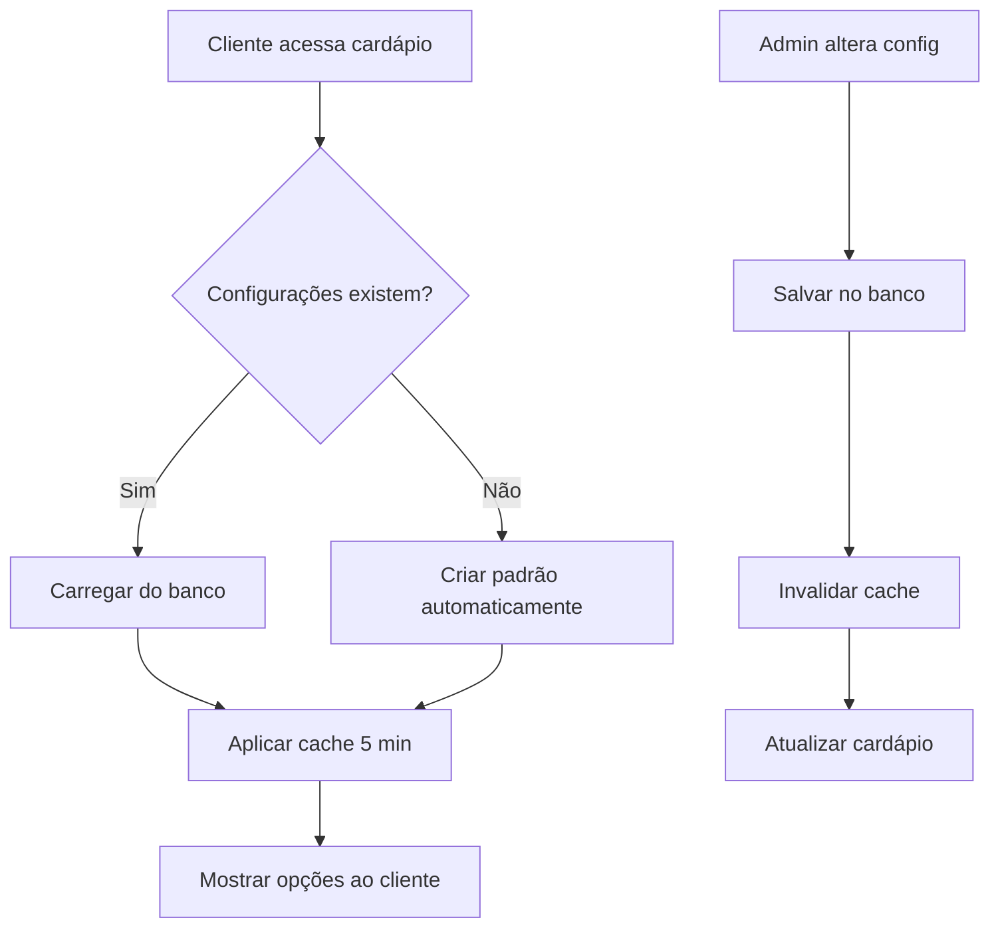

# 🚀 Solução Escalável de Formas de Entrega - Documentação Completa

## 📋 Visão Geral

Sistema totalmente escalável para gerenciar formas de entrega (delivery, retirada, consumo local) para múltiplas empresas, com configuração dinâmica via banco de dados e interface administrativa.

## 🏗️ Arquitetura da Solução

### 1. **Banco de Dados**
- Tabela `delivery_methods` com configurações por empresa
- Triggers para auto-criação de registros
- Validação automática (pelo menos uma opção ativa)
- View consolidada para visualização

### 2. **Frontend - Cardápio Digital**
- `CheckoutModal.tsx` - Componente escalável
- Auto-criação de configurações se não existirem
- Cache inteligente de 5 minutos
- Fallback para valores padrão

### 3. **Admin - Painel de Controle**
- `DeliveryMethodsManager.tsx` - Interface administrativa
- Templates rápidos de configuração
- Validação em tempo real
- Histórico de alterações

## 🔧 Instalação e Configuração

### Passo 1: Executar Script SQL

Execute no Supabase SQL Editor:

```sql
-- Arquivo: setup-delivery-methods-scalable.sql
-- Este script:
-- 1. Cria registros faltantes
-- 2. Configura triggers automáticos
-- 3. Adiciona validações
-- 4. Cria view de visualização
```

### Passo 2: Adicionar Interface Admin

Se ainda não existir, adicione a rota no admin:

```tsx
// Em seu arquivo de rotas do admin
import { DeliveryMethodsManager } from '@/components/admin/DeliveryMethodsManager';

// Adicionar rota
<Route path="/admin/delivery-methods" element={<DeliveryMethodsManager />} />
```

### Passo 3: Verificar Componente do Cardápio

O `CheckoutModal.tsx` já está configurado para:
- Buscar configurações do banco
- Auto-criar se não existir
- Cachear por 5 minutos
- Validar opções dinamicamente

## 📊 Como Funciona

### Fluxo de Dados



### Estados e Validações

1. **Sempre pelo menos uma opção ativa**
   - Trigger no banco impede desativar tudo
   - Validação no frontend
   - Validação no admin

2. **Cache inteligente**
   - 5 minutos no cardápio digital
   - Invalidação automática após alterações
   - Refetch ao focar janela

3. **Auto-criação**
   - Novas empresas = configuração padrão automática
   - Empresas sem config = criação ao primeiro acesso

## 🎯 Casos de Uso

### Empresa Nova
1. Criar empresa normalmente
2. Trigger cria `delivery_methods` automaticamente
3. Admin pode ajustar depois se necessário

### Mudança Temporária
```typescript
// Admin pode mudar rapidamente:
// Ex: Desabilitar delivery em dia de chuva
// 1. Acessar painel admin
// 2. Desmarcar "Delivery"
// 3. Salvar
// → Aplicado imediatamente
```

### Configurações por Tipo de Negócio
- **Restaurante**: Delivery + Retirada + Consumo Local
- **Delivery Only**: Apenas Delivery
- **Loja Física**: Apenas Retirada
- **Food Truck**: Apenas Consumo Local

## 🔍 Monitoramento

### Verificar Configurações Atuais

```sql
-- Ver todas as configurações
SELECT * FROM company_delivery_config;

-- Estatísticas gerais
SELECT 
    COUNT(*) as total_empresas,
    SUM(CASE WHEN delivery THEN 1 ELSE 0 END) as com_delivery,
    SUM(CASE WHEN pickup THEN 1 ELSE 0 END) as com_retirada
FROM delivery_methods;
```

### Logs de Alteração

```sql
-- Se implementar auditoria
SELECT * FROM delivery_methods_audit
WHERE company_id = 'xxx'
ORDER BY changed_at DESC;
```

## 🐛 Troubleshooting

### Problema: Opções não aparecem no cardápio

**Verificar:**
1. Configurações no banco: `SELECT * FROM delivery_methods WHERE company_id = 'xxx'`
2. Cache do navegador: Limpar com Ctrl+F5
3. Console do browser: Verificar erros

**Solução:**
```sql
-- Forçar recriação
DELETE FROM delivery_methods WHERE company_id = 'xxx';
-- Vai recriar automaticamente no próximo acesso
```

### Problema: Não consigo salvar no admin

**Verificar:**
- Pelo menos uma opção está marcada
- Permissões do usuário admin
- Conexão com Supabase

**Solução:**
```sql
-- Verificar e corrigir manualmente
UPDATE delivery_methods 
SET delivery = true, pickup = true 
WHERE company_id = 'xxx';
```

## 📈 Métricas e Performance

### KPIs Recomendados
- Taxa de abandono por falta de opção desejada
- Distribuição de pedidos por tipo de entrega
- Tempo médio de configuração no admin

### Performance
- Query inicial: ~50ms
- Cache hit: 0ms (instantâneo)
- Invalidação de cache: ~100ms
- Salvamento admin: ~200ms

## 🔐 Segurança

### RLS (Row Level Security)
```sql
-- Apenas admins podem modificar
CREATE POLICY "Admins can manage delivery methods"
ON delivery_methods
FOR ALL
USING (
    auth.uid() IN (
        SELECT user_id FROM company_users 
        WHERE company_id = delivery_methods.company_id 
        AND role IN ('admin', 'owner')
    )
);
```

### Validações
- Frontend: Impede desativar todas as opções
- Backend: Trigger valida antes de salvar
- Admin: Interface valida em tempo real

## 🚦 Checklist de Implementação

- [x] Script SQL executado
- [x] CheckoutModal atualizado
- [x] DeliveryMethodsManager criado
- [ ] Rota admin adicionada
- [ ] Permissões configuradas
- [ ] Teste com 3+ empresas
- [ ] Documentação da equipe
- [ ] Treinamento dos admins

## 📚 Referências

### Arquivos Principais
- `/src/components/cardapio/public/CheckoutModal.tsx` - Componente do cardápio
- `/src/components/admin/DeliveryMethodsManager.tsx` - Interface admin
- `/setup-delivery-methods-scalable.sql` - Script de configuração do banco
- `/src/services/deliveryOptionsService.ts` - Serviço de opções (opcional)

### Queries Úteis
```sql
-- Resetar tudo para padrão
UPDATE delivery_methods SET delivery = true, pickup = true, eat_in = false;

-- Encontrar empresas sem configuração
SELECT * FROM companies WHERE id NOT IN (SELECT company_id FROM delivery_methods);

-- Backup antes de mudanças
SELECT * FROM delivery_methods; -- Copiar resultado antes de alterar
```

## ✅ Conclusão

Esta solução é:
- **100% Escalável**: Funciona para N empresas
- **Auto-gerenciável**: Admins controlam tudo
- **Robusta**: Validações em múltiplas camadas
- **Performática**: Cache inteligente
- **Manutenível**: Código limpo e documentado

**Pronta para produção e crescimento!** 🚀
